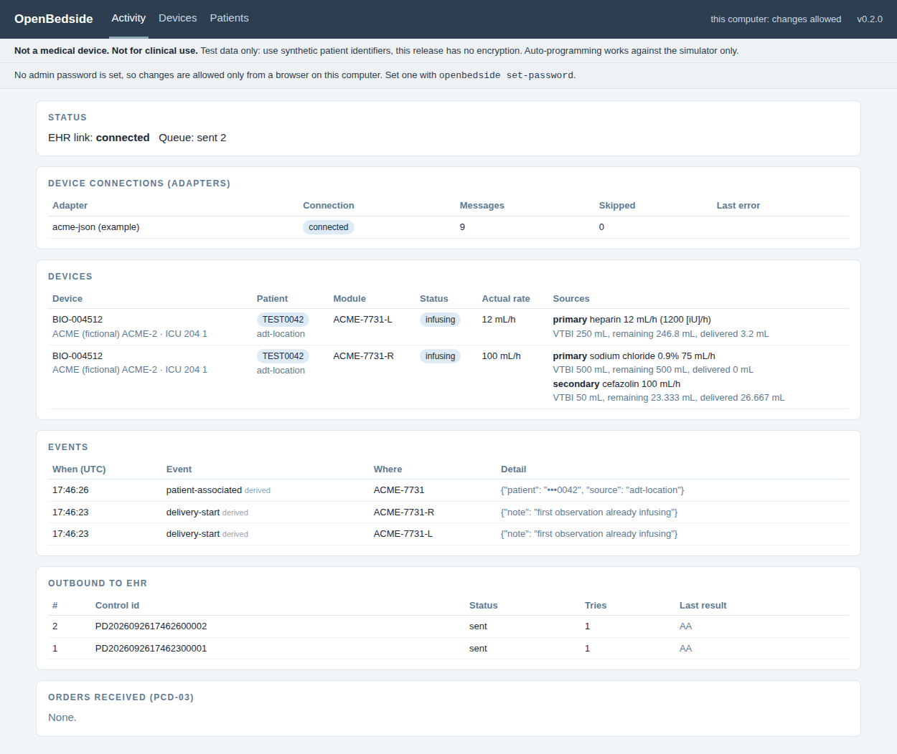
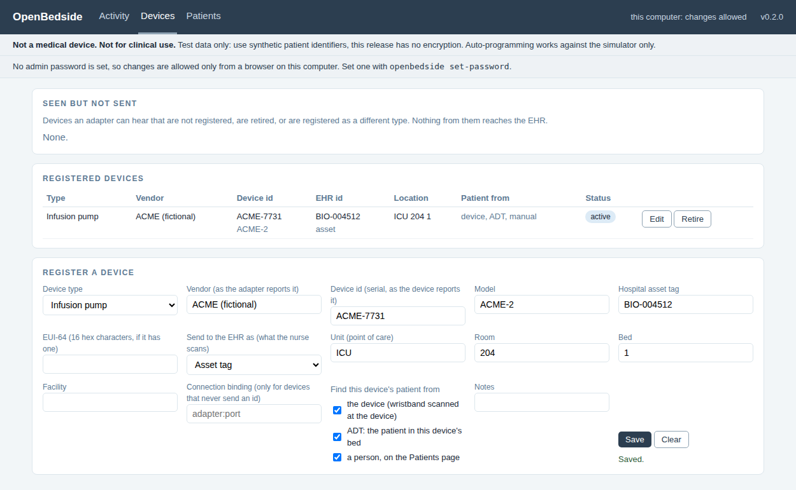
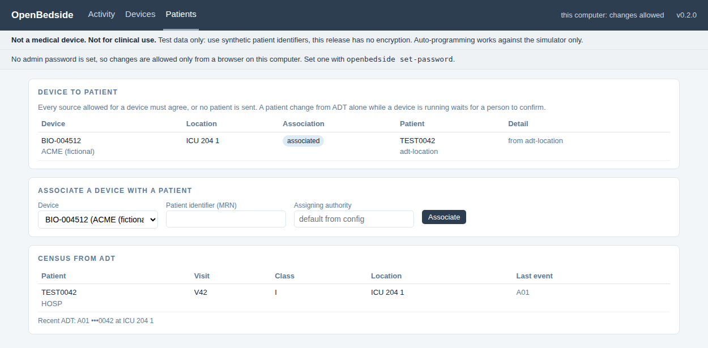

# User guide

How to run OpenBedside, read the interface activity page, change settings, and fix
the usual problems. For first-time installation, start with
[START-HERE-install-on-your-Mac.md](../START-HERE-install-on-your-Mac.md).

## Three ways to run it

| Command | What runs | Use it for |
|---|---|---|
| `openbedside demo` | gateway, pump simulator and a stand-in EHR, all in one window | seeing it work; showing someone |
| `openbedside ehr-sim` plus `openbedside run` | the same, in two windows, so you can watch every HL7 message arrive | testing and development |
| `openbedside run -c your.toml` | the gateway with your own adapters and a real (test) interface engine | integration work |

Before any of them, in each Terminal window or tab:

```
cd ~
source ~/.venvs/openbedside/bin/activate
```

Stop anything with **Ctrl-C**.

## The web page

Open **http://127.0.0.1:8080** while the gateway runs. It refreshes every two seconds
and has three pages, on the menu at the top: **Activity**, **Devices** and
**Patients**.

### Who can change things

Anyone who can open the page can look. Registering devices and associating patients
needs one of:

- **no admin password set** (the default): only a browser on the same computer as the
  gateway can make changes. The page says so in a banner;
- **an admin password**: anyone who signs in (button at top right). Set it once:

```
openbedside set-password                 # or: openbedside set-password -c your.toml
```

Viewers who are not signed in see patient identifiers masked to their last four
characters. Keep the page on localhost regardless: there is no encryption yet.

## Activity



**Status.** Whether the link to the EHR is up, the last connection error if not, and
how many messages are pending, sent or rejected.

**Device connections.** One row per adapter: connected or not, messages received,
messages skipped (could not be translated), and the last error. The first place to
look when a device does not appear.

**Devices.** One row per pump module of every registered device: the identifier sent to
the EHR, its location, its patient and where that came from, status, the rate it is
actually running, and each source hanging on it (primary and, when running, secondary) with drug, programmed rate,
dose rate, VTBI, volume remaining and delivered.

**Events.** What happened, newest first: delivery start, stop and complete, rate
changes, KVO, secondary to primary, communication lost and restored, and the patient
decisions (associated, cleared, conflict, review). Every one is labelled *derived*,
because OpenBedside works them out rather than the device reporting them, and says so.

**Outbound to EHR.** Every message queued for the hospital: its control id, whether it
was sent, how many tries it took, and the hospital's reply (AA means accepted).

**Orders received.** Test orders sent to the simulator and how they were answered.

The same information is available as JSON at http://127.0.0.1:8080/api/state for
anyone who wants to build their own view.

## Devices: registration

Nothing from a device reaches the EHR until it is registered.

**Seen but not sent** lists every device an adapter can hear that is not registered,
is retired, or is registered as a different type (a ventilator registration will not
carry pump data). Click **Register** and the form fills in what the device reported.



| Field | What it is for |
|---|---|
| Device type | infusion pump, ventilator, other. Must match what the adapter delivers |
| Vendor, device id | how the device identifies itself. Together they are the key: two vendors can both ship serial 12345 |
| Asset tag, EUI-64 | the hospital's tag, and the device's 64-bit id if it has one |
| Send to the EHR as | **what the nurse scans** to tie the device to a patient: serial, asset tag or EUI-64. If this does not match the label, device data never lands in a chart |
| Unit, room, bed, facility | where the device lives. Sent in PV1-3, and needed for association by ADT |
| Find this device's patient from | which sources may name the patient: the device, ADT for this bed, a person |
| Connection binding | only for devices that never send their own id, such as a serial device behind a terminal server port |

**Retire** stops a device being sent without deleting its history. Identity is never an
IP address.

## Patients: association

Each registered device's patient is decided from the sources its registration allows:

- **device**: the device reported an identifier (a wristband scanned at the pump);
- **manual**: someone associated them on this page;
- **ADT for this bed**: the hospital's ADT feed has exactly one patient in the device's
  registered bed.

| State | Meaning | What the EHR receives |
|---|---|---|
| associated | the allowed sources agree | the patient, and PV1 with their location and visit |
| none | no source has a patient | PID-3 `Unknown` |
| conflict | sources disagree, or two patients in one bed | PID-3 `Unknown` until fixed |
| review | ADT alone would change the patient while the device is running | PID-3 `Unknown` until someone clicks **Confirm new patient** |



A manual association stays until it is cleared. Clear it when the device comes off the
patient, or it will conflict with the next one.

**Census from ADT** is what the hospital's ADT feed has told the gateway: identifiers,
visit, class and location. Names are never stored.

To try it without a hospital:

```
openbedside send-adt --event A01 --mrn TEST0002 --unit ICU --room 101 --bed A
openbedside send-adt --event A02 --mrn TEST0002 --unit ICU --room 102 --bed B   # transfer
openbedside send-adt --event A03 --mrn TEST0002                                 # discharge
```

Use made-up identifiers only. This release is not for real patient data.

## Settings

Every setting, with its default, is in [config/example.toml](../config/example.toml).
Copy it somewhere outside iCloud-synced folders if you like, edit the copy, and run
`openbedside run -c path/to/copy.toml`. The ones most often changed:

| Setting | Default | Change it when |
|---|---|---|
| `[ehr] host`, `port` | 127.0.0.1, 6661 | pointing at a real (test) interface engine |
| `[ehr] receiving_app`, `receiving_facility` | EHR, HOSP | the interface engine expects specific MSH-5 and MSH-6 values |
| `[gateway] periodic_seconds` | 60 | the hospital wants snapshots more or less often |
| `[gateway] offline_after_seconds` | 30 | your device reports less often than every 30 seconds |
| `[gateway] database` | openbedside.db | you want the queue somewhere specific |
| `[ui] port` | 8080 | something else already uses 8080 |
| `[orders] enabled` | true | set false with real devices; orders are simulator-only |
| `[registry] unknown_devices` | hold | `send` sends unregistered devices with patient Unknown (lab use only) |
| `[patients] assigning_authority` | HOSP | the hospital's code for PID-3.4 |
| `[adt] host`, `port` | 127.0.0.1, 6663 | the interface engine sends ADT somewhere else |
| `[adt] enabled` | true | no ADT feed |

## Files it creates

`openbedside.db` (plus `-wal` and `-shm` files while running) in the folder you start
it from. It holds the outbound queue, the event log, the device registry, the ADT
census, manual associations and the admin password hash. Delete it to start clean:
pending messages, registrations and the password go with it.

## Problems and fixes

| You see | Cause | Fix |
|---|---|---|
| `command not found: openbedside` | the environment is not active in this window | `source ~/.venvs/openbedside/bin/activate` |
| `no such file or directory: .../activate` | the environment was never created | `python3 -m venv ~/.venvs/openbedside`, then install again |
| Browser: unable to connect | the gateway is not running, or stopped with an error | look at the gateway's window |
| `A port is already in use` | another copy is running, or another program uses the port | stop the other copy, or change the port in your config |
| EHR link: not connected | nothing is listening at `[ehr] host:port` | start `openbedside ehr-sim`, or check the interface engine address |
| Messages stuck *pending* | the EHR is down or not acknowledging | fix the link; they send in order once it is back |
| A message *rejected* | the receiver replied AR | read "last result"; the queue moves on, the message is kept |
| Adapter shows skipped messages | your device sent something the adapter could not translate | run `openbedside check` and read the warnings |
| `AE module is infusing` from send-order | correct behaviour | a pump will not take a new program while running |
| A device is connected but nothing is sent | it is not registered | Devices page, *Seen but not sent*, Register |
| Patient shows *conflict* | the allowed sources name different patients | read the detail; fix the ADT, clear the manual association, or change the device's sources |
| Patient shows *review* | the ADT patient in the bed changed while the device was running | check the bedside; **Confirm new patient** if it is right |
| "sign in to make changes" | an admin password is set | Sign in, top right |
| Save or Associate is greyed out | you are viewing from another computer with no password set | set a password, or use the gateway's own computer |

## Updating

Replace the files in your OpenBedside folder with the new version (or `git pull` if you
cloned it), then:

```
source ~/.venvs/openbedside/bin/activate
pip install -e ~/Documents/OpenBedside
```

## Windows

Install Python 3.11 or newer from python.org (tick "Add python.exe to PATH"). In
PowerShell:

```
py -m venv $HOME\.venvs\openbedside
$HOME\.venvs\openbedside\Scripts\Activate.ps1
pip install -e "$HOME\Documents\OpenBedside[dev]"
openbedside demo
```

## Removing it

Delete the environment folder `~/.venvs/openbedside`, the OpenBedside folder, and any
`openbedside.db` files. Nothing else on the computer is changed by installing it.
